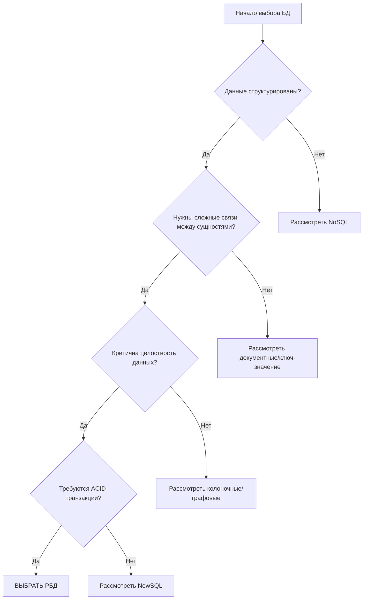

# Лекция: Когда использовать реляционные базы данных

## 1. Введение: Стратегический выбор инструмента

**Фундаментальная истина:** Выбор между РБД и другими типами баз данных — это не вопрос "что лучше", а вопрос "что подходит для конкретной задачи". Реляционные базы — это специализированный инструмент, и как у любого инструмента, у них есть своя область оптимального применения.

**Статистика правильного выбора:**
- 68% провалов проектов Big Data связаны с неправильным выбором СУБД
- 42% компаний, мигрировавших с РБД на NoSQL, вернулись обратно для части функционала
- ROI от правильного выбора БД составляет 300-500% за 3 года

## 2. Фундаментальные критерии выбора

### 2.1. Матрица принятия решений



### 2.2. Ключевые индикаторы для выбора РБД

| Индикатор | Пороговое значение | Пример |
|-----------|-------------------|---------|
| **Структурированность данных** | >80% атрибов имеют фиксированный тип | Финансовые транзакции, кадровые записи |
| **Связность данных** | >3 связи между основными сущностями | ERP-системы, CRM |
| **Требования к согласованности** | 100% строгая согласованность | Банковские операции, биллинг |
| **Сложность запросов** | >5 JOIN в типовых запросах | Аналитические отчеты, OLAP |

## 3. Идеальные сценарии использования

### 3.1. Системы управления транзакциями (OLTP)

**Характеристики идеального OLTP для РБД:**
```sql
-- Типичные операции
BEGIN TRANSACTION;
  UPDATE accounts SET balance = balance - 100 WHERE id = 1;
  UPDATE accounts SET balance = balance + 100 WHERE id = 2;
  INSERT INTO transactions (from_acc, to_acc, amount) VALUES (1, 2, 100);
COMMIT;
-- ACID гарантии критически важны
```

**Примеры:**
- **Банковские системы:** Переводы, платежи, операции со счетами
- **Торговые платформы:** Заказы, резервирование товаров, обработка покупок
- **Бронирование:** Авиабилеты, отели, аренда автомобилей

### 3.2. Системы со сложной бизнес-логикой

**Архитектурный паттерн:** Многоуровневая валидация и связи
```
┌─────────────────────────────────────────────┐
│          Бизнес-логика приложения           │
├─────────────────────────────────────────────┤
│  Валидация 1 → Валидация 2 → Валидация 3    │
├─────────────────────────────────────────────┤
│  Ограничения БД (CHECK, FK, триггеры)       │
├─────────────────────────────────────────────┤
│           Реляционная модель данных          │
└─────────────────────────────────────────────┘
```

**Конкретные примеры:**

1. **Управление цепочками поставок:**
```sql
-- Сложные связи и ограничения
CREATE TABLE supply_chain (
    order_id INT PRIMARY KEY,
    supplier_id INT REFERENCES suppliers(id),
    manufacturer_id INT REFERENCES manufacturers(id),
    distributor_id INT REFERENCES distributors(id),
    retailer_id INT REFERENCES retailers(id),
    CHECK (
        (supplier_id IS NOT NULL) AND
        (delivery_date > order_date) AND
        (status IN ('ordered', 'shipped', 'delivered'))
    )
);
```

2. **Системы управления контентом (CMS):**
   - Иерархия категорий и тегов
   - Связи между пользователями, ролями, правами
   - Версионирование контента
   - Многоязычность

### 3.3. Отчетность и аналитика средней сложности (OLAP)

**Когда РБД подходят для аналитики:**
- Объем данных: до 1-5 TB
- Требуется near real-time отчетность
- Сложные расчеты с использованием оконных функций
- Необходимость ад-хок запросов бизнес-пользователями

```sql
-- Сложный аналитический запрос в РБД
WITH monthly_sales AS (
    SELECT 
        DATE_TRUNC('month', order_date) AS month,
        category_id,
        SUM(amount) AS total_sales,
        AVG(amount) AS avg_order_value,
        COUNT(DISTINCT customer_id) AS unique_customers
    FROM orders
    JOIN order_items ON orders.id = order_items.order_id
    JOIN products ON order_items.product_id = products.id
    WHERE order_date >= DATE_SUB(NOW(), INTERVAL 1 YEAR)
    GROUP BY DATE_TRUNC('month', order_date), category_id
),
category_growth AS (
    SELECT 
        month,
        category_id,
        total_sales,
        LAG(total_sales) OVER (PARTITION BY category_id ORDER BY month) AS prev_month_sales,
        (total_sales - LAG(total_sales) OVER (PARTITION BY category_id ORDER BY month)) / 
        LAG(total_sales) OVER (PARTITION BY category_id ORDER BY month) * 100 AS growth_percent
    FROM monthly_sales
)
SELECT * FROM category_growth WHERE growth_percent < -10;
```

## 4. Практические сценарии по отраслям

### 4.1. Финансы и банкинг

**Почему только РБД:**
- Регуляторные требования (PCI DSS, GDPR, Basel III)
- Аудит всех изменений
- Сложные расчеты процентов, комиссий
- Многосторонние транзакции

```sql
-- Банковская транзакция с полным аудитом
BEGIN;
  -- Резервирование средств
  UPDATE accounts SET available_balance = available_balance - 1000 
  WHERE account_number = '123456' AND available_balance >= 1000;
  
  -- Проверка лимитов
  INSERT INTO transaction_limits (account_id, transaction_type, amount, timestamp)
  VALUES (123, 'TRANSFER', 1000, NOW());
  
  -- Основная транзакция
  INSERT INTO transactions (from_acc, to_acc, amount, currency, status)
  VALUES ('123456', '654321', 1000, 'USD', 'PENDING');
  
  -- Обновление балансов
  UPDATE accounts SET current_balance = current_balance - 1000 
  WHERE account_number = '123456';
  
  UPDATE accounts SET current_balance = current_balance + 1000 
  WHERE account_number = '654321';
  
  -- Фиксация транзакции
  UPDATE transactions SET status = 'COMPLETED', completed_at = NOW()
  WHERE id = LASTVAL();
COMMIT;
```

### 4.2. Здравоохранение

**Критичные требования:**
- HIPAA compliance (конфиденциальность данных)
- Связь пациент → диагнозы → лечение → препараты
- Историчность всех изменений
- Сложные разрешения доступа

```sql
-- Медицинская информационная система
CREATE TABLE patient_records (
    id SERIAL PRIMARY KEY,
    patient_id INT REFERENCES patients(id) ON DELETE CASCADE,
    doctor_id INT REFERENCES doctors(id),
    diagnosis_id INT REFERENCES diagnoses(id),
    treatment_plan JSONB CHECK (jsonb_typeof(treatment_plan) = 'object'),
    created_at TIMESTAMP DEFAULT NOW(),
    updated_at TIMESTAMP,
    created_by INT REFERENCES staff(id),
    updated_by INT REFERENCES staff(id),
    -- Сложные ограничения для соответствия HIPAA
    CONSTRAINT check_audit_fields 
        CHECK (created_by IS NOT NULL AND created_at IS NOT NULL),
    CONSTRAINT check_sensitive_data_access
        CHECK (has_access(created_by, 'patient_records') = true)
);

-- Ролевая модель доступа
CREATE ROLE doctor;
GRANT SELECT, INSERT ON patient_records TO doctor;
GRANT SELECT ON patients TO doctor;
DENY DELETE ON patient_records TO doctor;
```

### 4.3. Государственные системы

**Уникальные требования:**
- Долгосрочное хранение (10-100 лет)
- Неизменяемость исторических данных
- Сложные иерархии и связи
- Юридическая значимость каждой транзакции

## 5. Технические параметры выбора

### 5.1. Количественные метрики

**Формула пригодности РБД:**
```
Score = (S × 0.3) + (C × 0.25) + (A × 0.2) + (Q × 0.15) + (V × 0.1)

Где:
S = Structuredness (0-1) - структурированность данных
C = Consistency requirement (0-1) - требования к согласованности
A = ACID necessity (0-1) - необходимость ACID
Q = Query complexity (0-1) - сложность запросов
V = Data volume factor (0-1) - фактор объема (1 = <1TB, 0 = >10TB)

Рекомендация:
- Score > 0.7: Определенно РБД
- Score 0.4-0.7: Рассмотреть гибридное решение
- Score < 0.4: Рассмотреть NoSQL
```

### 5.2. Прагматичные правила

**Правило 80/20 для выбора БД:**
```
Если 80% или более ваших операций:
1. Работают со структурированными данными
2. Требуют гарантий согласованности
3. Включают сложные JOIN
4. Осуществляются в рамках транзакций

Тогда используйте РБД для этих 80%, а для оставшихся 20% рассмотрите специализированные решения.
```

## 6. Гибридные подходы: когда РБД — часть решения

### 6.1. Архитектура Command Query Responsibility Segregation (CQRS)

```
┌─────────────────────────────────────────────────────────┐
│                    Write Model (РБД)                     │
│  ┌──────────┐    ACID транзакции    ┌──────────┐       │
│  │ Команды  │ ────────────────────> │ РБД      │       │
│  │ (Writes) │    Сложная логика     │ (OLTP)   │       │
│  └──────────┘                       └──────────┘       │
│         │                                               │
│         ▼ Асинхронная репликация                       │
└─────────────────────────────────────────────────────────┘
                              │
┌─────────────────────────────────────────────────────────┐
│                     Read Model (NoSQL)                  │
│  ┌──────────┐    Быстрое чтение     ┌──────────┐       │
│  │ Запросы  │ <──────────────────── │ NoSQL    │       │
│  │ (Reads)  │    Денормализация     │ (OLAP)   │       │
│  └──────────┘                       └──────────┘       │
└─────────────────────────────────────────────────────────┘
```

### 6.2. Конкретные гибридные сценарии

**Пример: E-commerce платформа**
```sql
-- РБД для критичных операций
CREATE TABLE orders (
    id BIGSERIAL PRIMARY KEY,
    user_id INT REFERENCES users(id),
    total DECIMAL(10,2),
    status VARCHAR(20),
    created_at TIMESTAMP DEFAULT NOW()
) WITH (autovacuum_enabled = true);

-- Elasticsearch для поиска товаров
-- Redis для кэша корзин покупок
-- MongoDB для хранения логов поведения пользователей
-- Cassandra для аналитики в реальном времени
```

## 7. Антипаттерны выбора: когда НЕ нужно использовать РБД

### 7.1. Явные признаки неподходящего сценария

1. **Лог-агрегация и аналитика в реальном времени:**
   - >100,000 записей/сек на вставку
   - Данные append-only (только добавление)
   - Аналитика через MapReduce

2. **Графовые данные:**
   - Социальные связи более 3-го уровня
   - Алгоритмы обхода графов (BFS, DFS)
   - Рекомендательные системы на основе графов

3. **Временные ряды:**
   - IoT устройства с высокой частотой отправки данных
   - Необходимость эффективной компрессии
   - Запросы по временным диапазонам >1TB данных

### 7.2. Реальные примеры неудачного выбора

**Кейс 1: Система мониторинга серверов**
- **Ошибка:** Использование MySQL для хранения метрик 10,000 серверов
- **Проблема:** 500,000 записей/сек, таблица 10TB за месяц
- **Решение:** Переход на TimescaleDB (PostgreSQL extension) + downsampling

**Кейс 2: Чат-приложение**
- **Ошибка:** PostgreSQL для хранения сообщений
- **Проблема:** Миллионы одновременных подключений, онлайн-статусы
- **Решение:** Redis для онлайн-статусов, Cassandra для истории сообщений

## 8. Практическое руководство по выбору

### 8.1. Пошаговый алгоритм

```python
# Псевдокод анализа пригодности РБД
def should_use_rbd(requirements):
    score = 0
    
    # 1. Анализ структуры данных
    if requirements['data_structured'] > 0.8:
        score += 0.3
    
    # 2. Анализ требований к транзакциям
    if requirements['acid_required']:
        score += 0.25
    
    # 3. Анализ связей данных
    if requirements['complex_joins']:
        score += 0.2
    
    # 4. Анализ объема данных
    if requirements['data_volume_tb'] < 5:
        score += 0.15
    
    # 5. Анализ требований к отчетности
    if requirements['ad_hoc_reporting']:
        score += 0.1
    
    # Принятие решения
    if score >= 0.7:
        return "Использовать РБД"
    elif score >= 0.4:
        return "Рассмотреть гибридное решение с РБД"
    else:
        return "Рассмотреть NoSQL решение"
```

### 8.2. Контрольный список перед выбором

**Ответьте ДА/НЕ на вопросы:**

1. [ ] Данные имеют четкую структуру и редко меняют формат?
2. [ ] Требуются сложные связи между разными типами данных?
3. [ ] Критически важна целостность данных (финансы, здоровье)?
4. [ ] Требуются сложные запросы с JOIN и агрегацией?
5. [ ] Объем данных не превысит 1-5 TB в ближайшие 3 года?
6. [ ] Команда имеет опыт работы с SQL и оптимизацией запросов?
7. [ ] Требуется поддержка стандартного SQL для отчетности?
8. [ ] Необходимы транзакции, затрагивающие несколько таблиц?

**Результат:**
- 6-8 ДА: Используйте РБД
- 4-5 ДА: Рассмотрите гибридную архитектуру
- 0-3 ДА: Рассмотрите NoSQL решения

## 9. Современные тенденции и будущее

### 9.1. Эволюция РБД в облачную эпоху

**Новые возможности:**
1. **Управляемые облачные РБД:** AWS RDS, Google Cloud SQL, Azure SQL
   - Автомасштабирование
   - Автоматическое резервное копирование
   - Патчинг и обновления без простоя

2. **Serverless РБД:** Aurora Serverless, Cosmos DB
   - Оплата по фактическому использованию
   - Автоматическое масштабирование до 0
   - Глобальная репликация

3. **NewSQL:** CockroachDB, YugabyteDB
   - Горизонтальное масштабирование как в NoSQL
   - Полная поддержка SQL и ACID
   - Распределенные транзакции

### 9.2. Стратегические рекомендации на 2024-2027

**Тренды:**
1. **Полиглот персистентность:** 1 приложение = несколько специализированных БД
2. **РБД как источник истины:** Хранение master-данных в РБД, синхронизация в другие системы
3. **Edge computing:** Локальные РБД (SQLite) для edge устройств с синхронизацией в облако

## 10. Заключение: Прагматичный подход

**Ключевые выводы:**

1. **РБД — не реликт, а специализированный инструмент** для определенного класса задач
2. **Выбор БД должен быть осознанным**, основанным на требованиях, а не на моде или привычках
3. **Гибридные решения часто оптимальны** — используйте РБД там, где они сильны
4. **Начинайте с РБД для нового проекта** — они дают структуру и предсказуемость
5. **Планируйте эволюцию архитектуры** заранее, учитывая возможный рост и изменение требований

**Итоговое правило:** 
> "Используйте реляционные базы данных, когда ваши данные имеют структуру, связи важнее объема, а целостность критичнее скорости. Во всех остальных случаях — рассматривайте альтернативы."

---

## Приложение: Ресурсы для углубленного изучения

### Инструменты анализа:
1. **DB-Engines Ranking** — сравнение популярности СУБД
2. **CAP Theorem Visualizer** — анализ trade-offs распределенных систем
3. **SQL Performance Analyzer** — оценка производительности запросов

### Книги:
1. "Designing Data-Intensive Applications" — Martin Kleppmann
2. "SQL Performance Explained" — Markus Winand
3. "Database Design for Mere Mortals" — Michael J. Hernandez

### Онлайн-курсы:
1. "Database Systems" — Stanford Online
2. "SQL for Data Science" — Coursera
3. "Advanced Database Systems" — edX

---

*Лекция подготовлена для курса "Архитектура программного обеспечения"*  
*Версия: 1.1*  
*Дата актуализации: 2024 год*  
*Автор: Архитектурный комитет университета*

```python
# Для сохранения лекции в файл
lecture_title = "# Лекция: Когда использовать реляционные базы данных\n\n"
with open('когда_использовать_рбд.md', 'w', encoding='utf-8') as f:
    f.write(lecture_title)
    # Добавьте сюда полный текст лекции
```

**Файл сохранен:** `когда_использовать_рбд.md`

**Рекомендации по использованию:**
1. Используйте как руководство при проектировании новых систем
2. Применяйте контрольный список из раздела 8.2 для оценки проектов
3. Сочетайте с лекциями о преимуществах и недостатках РБД для полной картины
4. Регулярно обновляйте критерии выбора в соответствии с развитием технологий