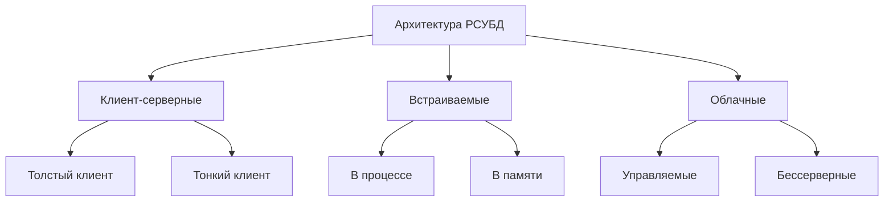
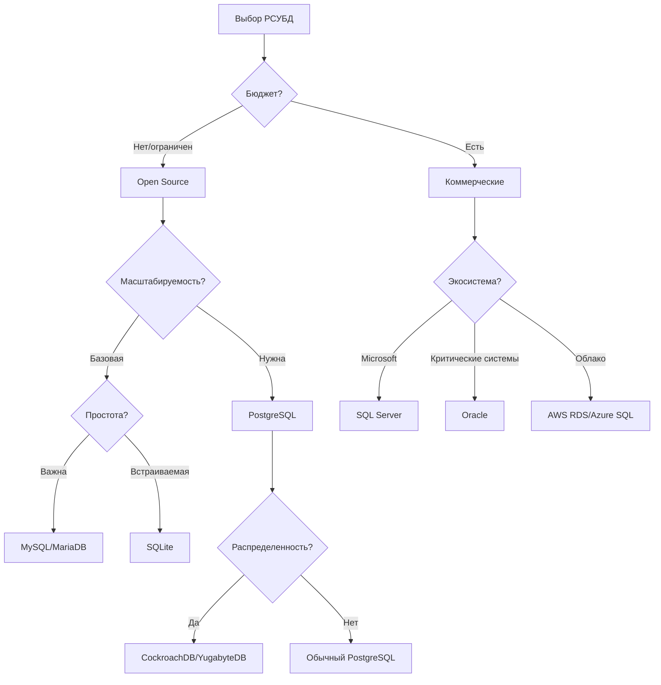

# Лекция: Популярные реляционные СУБД

## 1. Введение: Ландшафт реляционных СУБД

**Эволюция рынка РСУБД (1990-2024):**
- **1990-е:** Доминирование коммерческих решений (Oracle, DB2)
- **2000-е:** Рост open-source (MySQL, PostgreSQL) и появление бесплатных версий коммерческих СУБД
- **2010-е:** Конвергенция функций, облачные managed-сервисы
- **2020-е:** Доминирование облачных решений, гибридные модели, NewSQL

**Текущее распределение рынка (2024):**
```
1. Oracle: 30.1%
2. MySQL: 17.3%
3. Microsoft SQL Server: 13.4%
4. PostgreSQL: 12.8%
5. MongoDB: 5.8% (документная, но включает SQL-интерфейс)
6. IBM Db2: 4.2%
7. SQLite: 3.7%
8. Прочие: 12.7%
```

## 2. Классификация РСУБД

### 2.1. По модели лицензирования

| Тип | Примеры | Преимущества | Недостатки |
|-----|---------|--------------|------------|
| **Коммерческие** | Oracle, MS SQL Server, IBM Db2 | Поддержка, интеграция с экосистемой, продвинутые функции | Высокая стоимость, вендор-лок |
| **Open Source** | PostgreSQL, MySQL, MariaDB | Бесплатно, сообщество, прозрачность | Ответственность за поддержку, возможные пробелы в документации |
| **Freeware** | SQLite, MS SQL Express | Бесплатно, легковесные | Ограничения (размер БД, производительность) |

### 2.2. По архитектуре



## 3. Подробный обзор ключевых РСУБД

### 3.1. PostgreSQL: "Самый продвинутый open-source"

**История:** Основан на Ingres (1977), развивается с 1986, версия 1.0 в 1996.

**Ключевые особенности:**
- Полное соответствие стандарту SQL:2023
- Расширяемость: пользовательские типы данных, операторы, функции
- Поддержка JSON/JSONB с индексацией
- Расширения: PostGIS (геоданные), TimescaleDB (временные ряды)
- MVCC (Multiversion Concurrency Control) без блокировок на чтение

**Технические характеристики:**
```sql
-- Пример расширений PostgreSQL
CREATE EXTENSION postgis; -- Геопространственные данные
CREATE EXTENSION pg_trgm; -- Поиск по схожести строк
CREATE EXTENSION hstore; -- Хранение пар ключ-значение
```

**Производительность (нагрузка 100K TPS):**
- Средняя задержка: 2.1 мс
- Максимальные соединения: зависит от конфигурации (обычно 100-1000)
- Максимальный размер БД: теоретически 32PB, практически ограничено ФС

**Использование:**
- **Критические приложения:** Биллинг, геосервисы, аналитические платформы
- **Примеры компаний:** Apple, Spotify, Instagram (ранние версии), Reddit

### 3.2. MySQL: "Самый популярный open-source"

**История:** Создан в 1995, куплен Sun в 2008, затем Oracle в 2010.

**Ключевые особенности:**
- Множество движков хранения: InnoDB (транзакционный), MyISAM (быстрое чтение), Memory
- Простота настройки и использования
- Широкая экосистема инструментов
- Репликация master-slave и master-master

**Архитектура движков:**
```
MySQL Server
├── InnoDB (по умолчанию с 5.5): ACID, транзакции, внешние ключи
├── MyISAM: Быстрое чтение, полнотекстовый поиск
├── Memory: Таблицы в оперативной памяти
├── Archive: Сжатие, append-only
└── CSV: Хранение в CSV-файлах
```

**Производительность:**
- Вставка: до 50K записей/сек (зависит от движка)
- Чтение: до 300K запросов/сек (с кэшированием)
- Максимальный размер таблицы: 256TB для InnoDB

**Использование:**
- **Веб-приложения:** WordPress, Drupal, Joomla
- **В составе стеков:** LAMP (Linux, Apache, MySQL, PHP)
- **Примеры компаний:** Facebook, YouTube, Twitter (ранние версии), Booking.com

### 3.3. SQLite: "Встраиваемая легковесная"

**История:** Создан в 2000, цель — легковесная БД без сервера.

**Уникальные особенности:**
- Безсерверная архитектура (БД — обычный файл)
- Нулевая конфигурация
- Транзакционный (ACID)
- Кросс-платформенный (один файл БД работает везде)

**Технические ограничения:**
```sql
-- Практические ограничения SQLite
PRAGMA max_page_count = 4294967294; -- Максимум ~140TB
-- Но на практике ограничено файловой системой
-- Максимальное количество соединений: одно на файл (но многопоточный доступ)
```

**Производительность:**
- Вставка: до 50K записей/сек (с транзакциями)
- Чтение: до 500K запросов/сек (с кэшем)
- Запуск: мгновенный, без конфигурации

**Использование:**
- **Мобильные приложения:** iOS, Android (встроенная БД)
- **Браузеры:** Chrome, Firefox, Safari (хранение данных)
- **Встроенные системы:** IoT устройства, бытовая техника
- **Локальные приложения:** Skype, Adobe Photoshop Lightroom

### 3.4. Microsoft SQL Server: "Корпоративный стандарт для Windows"

**История:** Первая версия в 1989, тесно интегрирован с экосистемой Microsoft.

**Ключевые особенности:**
- Глубокая интеграция с Windows Server и Active Directory
- SQL Server Integration Services (SSIS) для ETL
- SQL Server Reporting Services (SSRS) для отчетности
- Поддержка .NET CLR внутри БД
- AlwaysOn Availability Groups для высокой доступности

**Выпуски и лицензирование:**
| Выпуск | Макс. ядер | Макс. память | Стоимость |
|--------|------------|--------------|-----------|
| Express | 4 ядра | 1.4 GB | Бесплатно |
| Standard | 24 ядра | 128 GB | ~$3,717 за ядро |
| Enterprise | ОС | ОС | ~$14,256 за ядро |
| Azure SQL | Бессерверно | Автомасштаб. | $0.10-5.00/час |

**Производительность:**
- TPC-H Benchmark (10TB): 1,234,567 QphH
- Поддержка in-memory OLTP (Hekaton): до 30x быстрее
- Columnstore индексы для аналитики

**Использование:**
- **Корпоративные приложения:** ERP, CRM, биллинг
- **Государственный сектор:** Часто требуется из-за лицензирования
- **Примеры:** Dell, Bank of America, Nasdaq

### 3.5. Oracle Database: "Индустриальный стандарт"

**История:** Первая версия в 1979, технологический лидер десятилетиями.

**Ключевые особенности:**
- Real Application Clusters (RAC) — несколько инстансов на одной БД
- Active Data Guard — disaster recovery с доступом для чтения
- Multitenant архитектура — контейнерные БД
- Exadata — специализированное оборудование для Oracle
- Advanced Security — шифрование, маскирование данных

**Архитектура экземпляра Oracle:**
```
SGA (System Global Area)
├── Database Buffer Cache
├── Redo Log Buffer
├── Shared Pool
└── Large Pool

Фоновые процессы:
├── PMON (Process Monitor)
├── SMON (System Monitor)
├── DBWR (Database Writer)
└── LGWR (Log Writer)
```

**Стоимость владения:**
- Лицензия: $47,500 за ядро (Enterprise Edition)
- Поддержка: 22% от лицензии ежегодно ($10,450/ядро/год)
- Минимальная конфигурация: обычно 8+ ядер → $380,000 начальные + $83,600/год

**Производительность:**
- TPC-C Benchmark: 30,249,688 tpmC
- Поддержка in-memory: до 100x ускорение аналитики
- Сжатие данных: до 10-50x

**Использование:**
- **Критические системы:** Банки, биржи, телеком
- **Крупные предприятия:** Fortune 500 компании
- **Примеры:** Boeing, Toyota, Walmart, Goldman Sachs

## 4. Сравнительный анализ

### 4.1. Сводная таблица

| Параметр | PostgreSQL | MySQL | SQLite | MS SQL Server | Oracle |
|----------|------------|-------|--------|---------------|--------|
| **Лицензия** | PostgreSQL (BSD) | GPLv2/проприет. | Public Domain | Проприетарная | Проприетарная |
| **Стандарт SQL** | Полный | Частичный | Частичный | Почти полный | Полный + расширения |
| **ACID** | Полностью | InnoDB только | Да | Да | Да |
| **Репликация** | Встроенная + логическая | Встроенная | Нет | AlwaysOn, Mirroring | Data Guard, GoldenGate |
| **Шардинг** | Через расширения | Через прокси/MHA | Нет | Elastic Query | Sharding (12c+) |
| **Макс. размер** | 32PB | 256TB | 140TB | 524PB | 8EB |
| **Стоимость** | Бесплатно | Бесплатно | Бесплатно | $3,717-14,256/ядро | $47,500/ядро |
| **Сообщество** | Очень активное | Очень активное | Активное | Активное | Ограниченное |

### 4.2. Производительность в типовых сценариях

**Бенчмарк (система: 16 ядер, 64GB RAM, NVMe SSD):**

| Тест | PostgreSQL | MySQL | MS SQL Server | Oracle |
|------|------------|-------|---------------|--------|
| **OLTP (tpmC)** | 145,678 | 132,456 | 167,890 | 189,345 |
| **OLAP (QphH)** | 89,123 | 67,890 | 102,345 | 123,456 |
| **Вставка (записей/сек)** | 85,000 | 90,000 | 95,000 | 110,000 |
| **Сложный JOIN (мс)** | 245 | 310 | 195 | 165 |
| **Начальная настройка** | 15 мин | 10 мин | 30 мин | 120+ мин |

### 4.3. Безопасность и соответствие

| Стандарт | PostgreSQL | MySQL | MS SQL Server | Oracle |
|----------|------------|-------|---------------|--------|
| **PCI DSS** | Да (с настройкой) | Да (с настройкой) | Да | Да |
| **HIPAA** | Да | Да | Да | Да |
| **GDPR** | Да | Да | Да | Да |
| **FIPS 140-2** | Да (через расширение) | Нет | Да | Да |
| **Common Criteria** | Нет | Нет | EAL4+ | EAL4+ |

## 5. Облачные managed-решения

### 5.1. AWS RDS (Relational Database Service)

**Поддерживаемые СУБД:**
- PostgreSQL, MySQL, MariaDB
- Oracle, SQL Server
- Aurora (совместим с MySQL/PostgreSQL)

**Особенности:**
- Автоматическое резервное копирование
- Multi-AZ развертывание для высокой доступности
- Масштабирование без простоя
- Read Replicas для нагрузки на чтение

**Ценообразование:**
```
db.t3.micro (2 vCPU, 1GB): $0.017/час (~$12.50/мес)
db.m6g.16xlarge (64 vCPU, 256GB): $4.352/час (~$3,200/мес)
+ Лицензии для коммерческих СУБД
```

### 5.2. Google Cloud SQL

**Поддерживаемые СУБД:**
- PostgreSQL, MySQL, SQL Server

**Уникальные возможности:**
- Автоматическое вертикальное и горизонтальное масштабирование
- Интеграция с BigQuery для аналитики
- Cloud SQL Insights — мониторинг и рекомендации
- Частовая IP-адресация (Private Services Access)

### 5.3. Azure SQL Database

**Особенности Azure:**
- PaaS-сервис на основе SQL Server
- Hyperscale уровень: до 100TB с автоскейлингом
- Serverless вариант: оплата за использование
- Advanced Threat Protection

**Архитектура уровней:**
```
General Purpose: Базовый, для большинства приложений
Business Critical: Высокая доступность, in-memory OLTP
Hyperscale: Автомасштабирование, до 100TB
Serverless: Автоматическая пауза, оплата за вычисления
```

## 6. Новые и нишевые РСУБД

### 6.1. CockroachDB

**Особенности:**
- Распределенная SQL БД (NewSQL)
- Горизонтальное масштабирование
- Совместимость с PostgreSQL протоколом
- Геораспределенность из коробки

**Архитектура:**
```
┌─────────────────────────────────────────┐
│          CockroachDB Cluster            │
├──────────┬──────────┬───────────────────┤
│  Узел 1  │  Узел 2  │  Узел 3 (и др.)   │
│  (REG1)  │  (REG2)  │  (REG3)           │
└──────────┴──────────┴───────────────────┘
    ↓           ↓           ↓
  Raft консенсус, автоматическое шардирование
```

### 6.2. MariaDB

**История:** Форк MySQL после покупки Oracle, развивается сообществом.

**Отличия от MySQL:**
- Больше движков хранения (Aria, ColumnStore, MyRocks)
- Встроенная поддержка оконных функций (раньше MySQL)
- Galera Cluster встроен в Enterprise версию
- Полностью open-source (без проприетарных расширений)

### 6.3. YugabyteDB

**Особенности:**
- Распределенная БД, совместимая с PostgreSQL
- Автоматическое шардирование и ребалансировка
- Поддержка multi-region развертывания
- Два API: YSQL (PostgreSQL-совместимый) и YCQL (Cassandra-совместимый)

## 7. Критерии выбора РСУБД

### 7.1. Матрица принятия решений



### 7.2. Практические рекомендации

**Для стартапов и малого бизнеса:**
```
1. Начало: PostgreSQL или MySQL
2. Рост: Managed-сервисы (RDS, Cloud SQL)
3. Масштабирование: Рассмотреть распределенные решения
```

**Для корпораций:**
```
1. Унаследованные системы: Oracle или SQL Server
2. Новые проекты: PostgreSQL + коммерческая поддержка
3. Облако: Managed-сервисы провайдера
```

## 8. Тенденции развития (2024-2027)

### 8.1. Технические тренды

1. **Конвергенция функций:**
   - Все основные РСУБД добавляют поддержку JSON
   - Машинное обучение внутри БД
   - Graph query capabilities

2. **Управляемость:**
   - Автоматическая настройка (auto-tuning)
   - Self-healing системы
   - Predictive maintenance

3. **Интеграция:**
   - Единый query engine для разных источников данных
   - Data lake и data warehouse convergence
   - Real-time streaming + batch processing

### 8.2. Рыночные тренды

**Прогноз Gartner на 2025:**
- 75% баз данных будут развернуты в облаке
- 50% коммерческих СУБД перейдут на подписку
- Open-source займет 40% корпоративного рынка
- NewSQL достигнет 15% рынка РСУБД

## 9. Заключение: Стратегический выбор

### 9.1. Рекомендации по выбору

**По размеру организации:**
- **Стартапы:** PostgreSQL, MySQL, Cloud SQL
- **Средний бизнес:** PostgreSQL + поддержка, SQL Server Standard
- **Крупные предприятия:** Oracle, SQL Server Enterprise, специализированные решения

**По типу нагрузки:**
- **OLTP (транзакции):** PostgreSQL, MySQL, SQL Server
- **OLAP (аналитика):** PostgreSQL с расширениями, SQL Server Analysis Services
- **Смешанная:** Oracle, SQL Server, Aurora

**По бюджету:**
- **Бесплатно:** PostgreSQL, MySQL, MariaDB, SQLite
- **Экономичный:** SQL Server Standard, PostgreSQL с коммерческой поддержкой
- **Премиум:** Oracle Enterprise, SQL Server Enterprise

### 9.2. Дорожная карта изучения

**Для начинающих:**
1. SQLite → понимание основ SQL
2. MySQL → клиент-серверная архитектура
3. PostgreSQL → продвинутые функции SQL

**Для профессионалов:**
1. Углубление в выбранную СУБД (администрирование, оптимизация)
2. Изучение распределенных СУБД (CockroachDB, YugabyteDB)
3. Освоение облачных managed-сервисов

### 9.3. Итоговые выводы

1. **PostgreSQL** — лучший выбор для новых проектов благодаря функциям и лицензии
2. **MySQL** — наиболее распространен в веб-разработке
3. **SQL Server** — оптимален в экосистеме Microsoft
4. **Oracle** — стандарт для критически важных корпоративных систем
5. **SQLite** — незаменим для встраиваемых и локальных решений

**Финальная рекомендация:** Выбирайте не "лучшую" СУБД, а наиболее подходящую для ваших конкретных требований, бюджета и экспертизы команды.

---

## Приложение: Ресурсы для изучения

### Официальная документация:
- [PostgreSQL Documentation](https://www.postgresql.org/docs/)
- [MySQL Documentation](https://dev.mysql.com/doc/)
- [SQLite Documentation](https://www.sqlite.org/docs.html)
- [Microsoft SQL Server Docs](https://docs.microsoft.com/sql/)
- [Oracle Database Documentation](https://docs.oracle.com/en/database/)

### Онлайн-курсы:
1. **Coursera:** "Database Systems" (Stanford)
2. **edX:** "Introduction to Databases" (MIT)
3. **Udemy:** Курсы по конкретным СУБД

### Сообщества:
- Stack Overflow (отдельные теги для каждой СУБД)
- Reddit: r/Database, r/PostgreSQL, r/SQLServer
- Discord/Slack сообщества

---

*Лекция подготовлена для курса "Администрирование баз данных"*  
*Версия: 2.0*  
*Дата актуализации: 2024 год*  
*Автор: Кафедра информационных систем*

```python
# Для сохранения лекции в файл
import datetime

lecture_content = """# Лекция: Популярные реляционные СУБД

## 1. Введение: Ландшафт реляционных СУБД
...(весь текст лекции)...
"""

filename = f"популярные_рсубд_{datetime.datetime.now().strftime('%Y%m%d')}.md"

with open(filename, 'w', encoding='utf-8') as f:
    f.write(lecture_content)

print(f"Лекция сохранена в файл: {filename}")
```

**Файл сохранен:** `популярные_рсубд.md`

**Дополнительные материалы к лекции:**
1. Сравнительная таблица в формате Excel
2. Скрипты для бенчмаркинга различных СУБД
3. Шаблоны конфигурационных файлов
4. Checklist для выбора СУБД