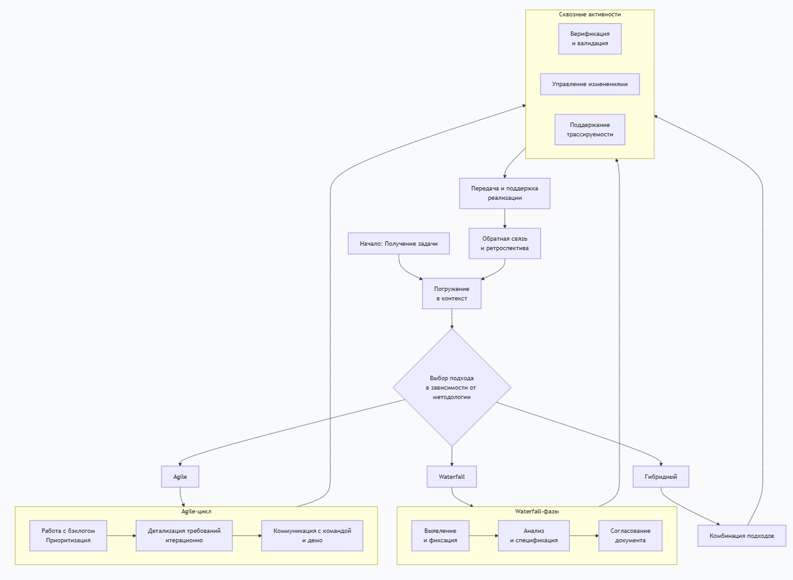
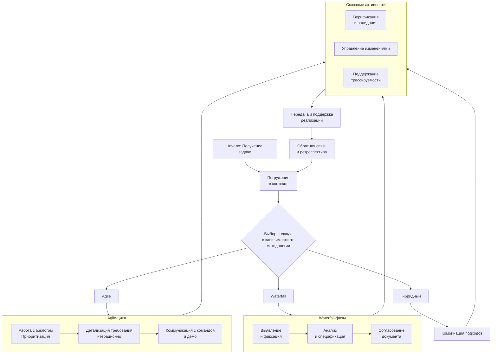

Работа аналитика с требованиями — это **циклический и итеративный процесс**, сочетающий аналитику, коммуникацию и управление. Вот подробный разбор этого процесса, разделенный на ключевые деятельности.

---

### **1. Погружение в контекст и планирование**
Прежде чем работать с требованиями, аналитик должен понять **зачем** и **в каких рамках** это делается.
*   **Изучение бизнес-целей:** Зачем нужен продукт/изменение? Какую проблему решает?
*   **Выявление стейкхолдеров:** Кто заказчик, пользователи, эксперты, регуляторы? Составление карты заинтересованных сторон.
*   **Выбор подхода и инструментов:** В зависимости от методологии проекта (Agile, Waterfall, гибрид) аналитик определяет, как будет вестись работа (бэклог, SRS), и выбирает инструменты (Jira, Confluence, Miro, специализированные RM-системы).

---

### **2. Выявление (Elicitation) — «Достать» требования**
Цель: собрать всю необходимую информацию у стейкхолдеров. Это не просто запись пожеланий, а активный исследовательский процесс.
*   **Ключевые техники:**
    *   **Интервью:** Структурированные беседы с ключевыми лицами.
    *   **Воркшопы (Workshops):** Коллективные сессии (например, Event Storming, User Story Mapping) для совместного проектирования.
    *   **Наблюдение (Shadowing):** Просмотр рабочих процессов пользователей вживую.
    *   **Анализ документов:** Изучение регламентов, отчетов, данных существующих систем.
    *   **Бенчмаркинг:** Анализ решений конкурентов и аналогов.
*   **Результат:** «Сырые» данные: записи, скриншоты, ментальные карты, аудиозаписи, бизнес-правила.

---

### **3. Анализ и структурирование — «Осмыслить и упорядочить»**
Цель: превратить разрозненную информацию в согласованный, полный, непротиворечивый набор требований.
*   **Ключевые активности:**
    *   **Формализация:** Перевод мыслей пользователей «хочу, чтобы было удобно» в конкретные, проверяемые утверждения.
    *   **Разрешение конфликтов:** Если разные стейкхолдеры хотят противоположного, аналитик выступает медиатором и ищет решение, удовлетворяющее бизнес-цели.
    *   **Декомпозиция:** Разбиение крупных требований (Epic, Feature) на более мелкие и управляемые (User Stories, Use Cases).
    *   **Моделирование:** Создание визуальных моделей для прояснения сложных аспектов.
        *   **BPMN / Диаграммы процессов:** Как работает бизнес-процесс.
        *   **Use Case Diagram:** Кто и как взаимодействует с системой.
        *   **Прототипы и вайрфреймы (в Figma, Balsamiq):** Как будет выглядеть интерфейс.
        *   **Диаграммы состояний:** Как меняется состояние объекта (например, заказа).
*   **Результат:** Структурированный набор требований (например, бэклог продукта или черновик SRS).

---

### **4. Документирование и спецификация — «Зафиксировать»**
Цель: создать артефакты, которые будут использоваться для разработки, тестирования и согласования.
*   **Выбор формата под задачу:**
    *   **User Story + Acceptance Criteria:** «Как [роль], я хочу [функция], чтобы [ценность]. Принято, когда [критерии]». Основной формат в Agile.
    *   **Use Case:** Детальное описание сценария взаимодействия актора с системой (основной поток, альтернативные потоки).
    *   **Текстовая спецификация (SRS):** Структурированный документ с разделами для функциональных, нефункциональных требований и ограничений (чаще в Waterfall).
    *   **Таблицы атрибутов качества:** Для нефункциональных требований (производительность, безопасность).
*   **Важно:** Документация должна быть **четкой, однозначной и проверяемой**.

---

### **5. Валидация и согласование — «Убедиться, что всё верно»**
Цель: убедиться, что документированные требования действительно отражают потребности бизнеса и пользователей.
*   **Техники:**
    *   **Ревью требований:** Проведение встреч со стейкхолдерами для постраничного просмотра и обсуждения спецификаций.
    *   **Демонстрация прототипов:** Показать «как будет работать» на кликабельных макетах, чтобы получить обратную связь до начала разработки.
    *   **Формулировка критериев приемки (Acceptance Criteria):** Совместно с заказчиком и тестировщиками определение условий, при которых требование считается выполненным.

---

### **6. Управление приоритизацией — «Определить порядок»**
Цель: помочь Product Owner или заказчику определить, что важнее и что делать в первую очередь.
*   **Методы:** **MoSCoW**, **Cost of Delay / WSJF** (Weighted Shortest Job First), **приоритизация по ценности и усилиям**, **матрица Эйзенхауэра**.
*   **Результат:** Упорядоченный бэклог продукта или план реализации.

---

### **7. Управление изменениями и трассируемость — «Контролировать эволюцию»**
Цель: контролировать изменения и обеспечивать связность артефактов.
*   **Управление изменениями:**
    *   Фиксация всех запросов на изменение.
    *   Анализ impact: как изменение повлияет на сроки, бюджет, другие требования.
    *   Принятие решения (вместе с PO/заказчиком) о внесении изменений.
*   **Трассируемость:**
    *   Поддержание связей между бизнес-целью -> требованиями пользователя -> функциональными требованиями -> задачами разработки -> тест-кейсами.
    *   **Зачем?** Чтобы видеть, как каждое требование реализовано, и чтобы при изменении одного элемента быстро найти все зависимые.

---

### **8. Поддержка разработки и тестирования — «Быть мостом»**
Цель: обеспечить непрерывную коммуникацию и прояснение требований в ходе реализации.
*   **Участие в планировании спринтов:** Помощь команде в оценке и понимании задач.
*   **Уточнение требований «на лету»:** Ответы на вопросы разработчиков и тестировщиков, оперативное прояснение деталей.
*   **Приёмка (Acceptance Testing):** Участие в проверке реализованного функционала на соответствие критериям приемки.

---

### **9. Валидация готового решения — «Проверить результат»**
Цель: убедиться, что реализованная система решает исходные бизнес-задачи и удовлетворяет пользователей.
*   **Анализ обратной связи** от пользователей после релиза.
*   **Сравнение** достигнутых метрик с заявленными бизнес-целями.
*   **Формирование идей для улучшений** на основе данных, запуск нового цикла работы с требованиями.

### **Качества и навыки успешного аналитика в этом процессе:**
*   **Мягкие навыки (Soft Skills):** Коммуникация, эмпатия, фасилитация, медиация, критическое мышление.
*   **Аналитические техники:** Моделирование, декомпозиция, абстрактное мышление.
*   **Предметная экспертиза:** Глубокое понимание домена, в котором ведется работа.
*   **Техническая грамотность:** Понимание основ разработки, архитектуры, тестирования, чтобы говорить с командой на одном языке.

**Итог:** Аналитик — это не просто «писатель требований». Это **исследователь, переводчик, проектировщик и переговорщик**, который управляет знаниями и ожиданиями на протяжении всего жизненного цикла продукта, обеспечивая создание ценности для бизнеса и пользователей.