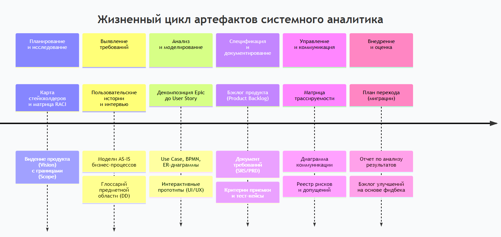
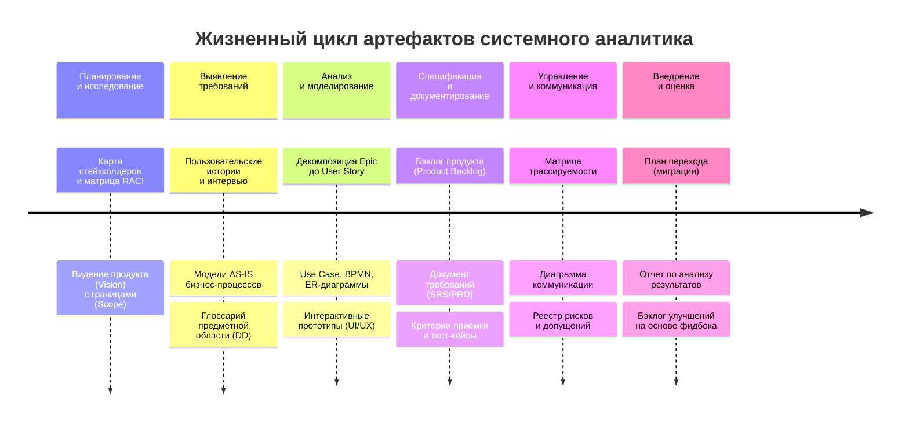

Отличный запрос! Артефакты системного аналитика — это конкретные документы, модели и результаты работы, создаваемые на каждом этапе. Их набор сильно зависит от методологии проекта (Agile/Waterfall/гибрид).

Вот подробная разбивка по ключевым этапам работы.

---

### **Этап 1. Планирование и исследование контекста**
**Цель:** Понять границы проекта, цели и окружение.
*   **Карта стейкхолдеров (Stakeholder Map/Matrix):** Идентификация всех заинтересованных сторон, их ролей, интересов и влияния. Часто с использованием **RACI-матрицы**.
*   **Видение продукта (Product Vision):** Короткий документ, описывающий *зачем* создается продукт, его основную ценность, целевую аудиторию и ключевые отличия (1-2 страницы).
*   **Контекстная диаграмма (Context Diagram):** Простейшая модель системы «как черного ящика», показывающая ее границы и ключевые потоки данных/событий с внешними сущностями (пользователи, другие системы).
*   **Документ о границах проекта (Scope Statement) / Чек-лист фичей (Feature List):** Предварительный список крупных блоков функциональности, который поможет оценить объем.

---

### **Этап 2. Выявление требований**
**Цель:** Собрать «сырые» потребности и данные.
*   **Записи интервью/воркшопов (Interview Notes / Workshop Minutes):** Структурированные заметки, фотографии досок (Miro, MURAL), аудиозаписи (с разрешения).
*   **Модели бизнес-процессов AS-IS («как есть»):** Обычно в нотации **BPMN 2.0** или простых блок-схемах. Показывают текущие процессы, чтобы найти точки боли и улучшения.
*   **Глоссарий предметной области (Domain Glossary):** Определение ключевых бизнес-терминов, аббревиатур, сущностей. Крайне важен для создания общего языка.
*   **Пользовательские истории высокого уровня (Epic, Feature):** Крупные, еще не детализированные потребности пользователей.
*   **Анализ конкурентов (Competitor Analysis):** Сводная таблица или отчет с выводами.

---

### **Этап 3. Анализ, структурирование и моделирование**
**Цель:** Превратить сырые данные в структурированные, формальные модели.
*   **Артефакты моделирования (ключевые):**
    *   **Use Case Diagram:** Диаграмма вариантов использования. Показывает акторов и ключевые возможности системы.
    *   **Детализированные Use Case / Сценарии:** Текстовое описание основного и альтернативных потоков событий.
    *   **Диаграмма классов (Class Diagram) / Модель данных (ER-диаграмма):** Описывает ключевые бизнес-сущности, их атрибуты и взаимосвязи.
    *   **Диаграммы бизнес-процессов TO-BE («как будет»):** Модели новых, оптимизированных процессов после внедрения системы.
    *   **Диаграмма состояний (State Transition Diagram):** Показывает, как меняется состояние объекта (например, «Заявка»: Черновик -> На согласовании -> Одобрена).
    *   **Диаграмма последовательности (Sequence Diagram):** Визуализирует взаимодействие между объектами/системами во времени для конкретного сценария.
*   **Прототипы интерфейса (UI Prototypes):**
    *   **Вайрфреймы (Wireframes):** Схематичные черно-белые макеты, расставляющие акценты на структуре и функциональности.
    *   **Макеты (Mockups):** Визуально проработанные, статичные изображения экранов.
    *   **Кликабельные прототипы (Clickable Prototypes):** Интерактивная модель, симулирующая работу интерфейса (Figma, Axure).
*   **Декомпозиция требований:**
    *   **Дерево функциональности (Functional Decomposition Tree) / Mind Map:** Иерархическая структура функций системы.
    *   **Детализированные User Stories:** С четкими критериями приемки (Acceptance Criteria).

---

### **Этап 4. Спецификация и документирование**
**Цель:** Создать итоговые документы для разработки, тестирования и согласования.
*   **Бэклог продукта (Product Backlog):** **Главный артефакт в Agile.** Приоритизированный список всех требований (User Stories, фичи, тех. долг).
*   **Спецификация требований к ПО (Software Requirements Specification — SRS):** **Главный документ в Waterfall.** Детальный, структурированный документ, описывающий функциональные и нефункциональные требования, ограничения, интерфейсы.
*   **Документ о бизнес-требованиях (Business Requirements Document — BRD):** Описывает требования с бизнес-перспективы (цели, метрики успеха, основные процессы).
*   **Матрица атрибутов качества (Quality Attributes Matrix):** Таблица, конкретизирующая нефункциональные требования (производительность, безопасность и т.д.) в измеримых показателях.

---

### **Этап 5. Валидация, управление и коммуникация**
**Цель:** Обеспечить контроль, согласование и отслеживание требований.
*   **Матрица трассируемости требований (Requirements Traceability Matrix — RTM):** Таблица, связывающая требования с их источниками (бизнес-цели) и артефактами реализации (дизайн, код, тесты). **Ключевой артефакт для сложных и регулируемых проектов.**
*   **Решение по требованиям (Requirements Sign-off):** Формальный документ о согласовании требований ключевыми стейкхолдерами.
*   **Реестр рисков (Risk Register):** Часто ведется аналитиком — идентификация, анализ и план реагирования на риски, связанные с требованиями (неясность, изменения, конфликты).
*   **Диаграмма коммуникации:** План, кто, что, когда и в какой форме должен получать информацию о требованиях.

---

### **Этап 6. Поддержка реализации и внедрения**
**Цель:** Обеспечить корректную реализацию требований и успешный переход.
*   **Уточненные критерии приемки (Acceptance Criteria) и тест-кейсы:** Часто аналитик помогает тестировщикам формулировать сценарии проверки.
*   **Решение по спорным требованиям (Clarification Notes):** Зафиксированные ответы на вопросы команды разработки по требованиям.
*   **План перехода (Transition Plan) / Миграции данных:** Описание шагов по внедрению системы и переносу данных (если аналитик участвует в этой работе).

### **Сводная таблица: Agile vs Waterfall**

| Этап | Agile-артефакты (Scrum) | Waterfall-артефакты |
| :--- | :--- | :--- |
| **Планирование** | Product Vision, Roadmap | Project Charter, Feasibility Study |
| **Выявление** | User Story Map, Personas | BRD (Business Requirements Document) |
| **Спецификация** | **Product Backlog** (живой, приоритизированный список User Stories с критериями) | **SRS** (объемный фиксированный документ) |
| **Моделирование** | Легковесные схемы «на салфетке», прототипы | Формальные диаграммы (UML, BPMN), детальные модели |
| **Управление** | Бэклог спринта, Доска задач (Jira) | Матрица трассируемости (RTM), реестр изменений |
| **Валидация** | Демо в конце спринта, сессии с пользователями | Формальные инспекции и подписание документов (Sign-off) |

### **Ключевые выводы:**
1.  **Артефакт — это инструмент, а не самоцель.** Выбор артефактов зависит от сложности проекта, требований заказчика и методологии.
2.  **Визуальные модели (диаграммы, прототипы) зачастую эффективнее текста.** Они упрощают понимание сложных систем.
3.  **В Agile артефакты «живые» и постоянно уточняются** (бэклог), в Waterfall — более формальные и статичные (SRS).
4.  **Главная цель** — не создать все артефакты, а **обеспечить общее понимание, снизить неопределенность и минимизировать риски** дорогостоящих ошибок в разработке.