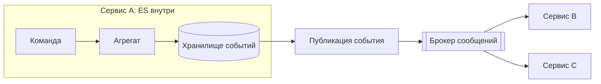

-------------------------------------------------------------------------------
Паттерны архитектуры систем
-------------------------------------------------------------------------------
Отлично. Разберём каждый из перечисленных архитектурных паттернов подробно, с фокусом на их влияние на безопасность системы, а также на то, как в них встраиваются механизмы защиты информации.

---

## 🧱 1. Layered Architecture (Многослойная архитектура)

**Классическое вертикальное разделение системы на слои**, каждый из которых выполняет строго определённую функцию и взаимодействует только с соседними слоями (обычно сверху вниз). Типичные слои: представление (UI), бизнес-логика (Service), доступ к данным (Repository / DAO), база данных.

### Когда использовать
- Корпоративные веб-приложения со стабильной предметной областью.
- Команды, мыслящие в парадигме "фронт — бэк — база".
- Быстрый старт, когда чёткие границы микросервисов ещё не определены.

### Аспекты безопасности
- **Поверхность атаки**: Расширяется вертикально. Уязвимость на любом слое может скомпрометировать данные.
- **Аутентификация и авторизация**: Обычно реализуются на уровне представления или на слое бизнес-логики. Часто используется централизованный фильтр (Servlet Filter, Middleware), который проверяет токен доступа и внедряет контекст безопасности в бизнес-слой. Подходит паттерн **Security through Layered Defense**: валидация ввода на Presentation, проверка бизнес-правил на Service, защита от SQL-инъекций на Persistence.
- **Аудит**: Легко добавить сквозной аудит на границе слоёв (AOP, перехватчики).
- **Проблемы**: Если защита реализована только на верхнем слое, внутренний вызов в обход UI может обойти все проверки. Необходимо обеспечивать безопасность на каждом слое, а не только на периметре.

---

## 🖥️ 2. Client-Server

**Разделение системы на поставщика ресурсов (сервер) и потребителей (клиентов)**, взаимодействующих по сети.

### Когда использовать
- Централизованные банковские системы, CRM, ERP, где множество тонких клиентов подключаются к мощному серверу.
- Удалённый доступ к базам данных.

### Аспекты безопасности
- **Главная угроза**: Сеть между клиентом и сервером — недоверенная среда.
- **Защита канала**: Обязателен TLS (HTTPS, защищённые веб-сокеты).
- **Аутентификация**: Сервер должен строго аутентифицировать каждого клиента. Для тонких клиентов возможна аутентификация на основе сертификатов (mTLS), для браузерных — OIDC (Keycloak). Нельзя доверять клиенту — вся логика авторизации на сервере.
- **Контроль доступа**: Сервер централизованно управляет всеми политиками доступа (RBAC, ABAC).

---

## 🌐 3. Service-Oriented Architecture (SOA)

**Архитектурный стиль, где приложение строится как набор взаимосвязанных сервисов**, общающихся через стандартизированные протоколы (часто SOAP, XML, WSDL, ESB — корпоративная сервисная шина). В отличие от микросервисов, SOA обычно подразумевает тяжёлую инфраструктуру и общую модель данных.

### Когда использовать
- Крупные правительственные системы (Госуслуги), ERP-системы (SAP), где требуется оркестровка множества унаследованных приложений.
- Интеграция гетерогенных систем, построенных на разных технологиях.

### Аспекты безопасности
- **Централизованная шина (ESB)** выступает единой точкой входа и контроля. Здесь же размещаются политики безопасности.
- **Протоколы**: WS-Security для SOAP (XML Signature, XML Encryption), SAML для федерации.
- **Identity Federation**: Часто используются корпоративные IdP, поддерживающие SAML 2.0.
- **Риски**: ESB становится критической точкой отказа и привлекательной целью. Требуется строгий аудит всех сообщений, проходящих через шину.

---

## 🔌 4. Microkernel / Plug-in

**Система с минимальным ядром**, обеспечивающим базовую функциональность (часто загрузку, управление жизненным циклом, реестр плагинов), и набором подключаемых модулей, реализующих бизнес-логику.

### Когда использовать
- IDE (Eclipse, IntelliJ IDEA), где плагины добавляют поддержку языков.
- ERP-системы с модулями для разных отделов.
- Системы, требующие кастомизации под каждого клиента.

### Аспекты безопасности
- **Изоляция плагинов**: Ключевая задача — не дать скомпрометированному плагину разрушить ядро или другие плагины. Используется песочница (sandbox), секьюрити-менеджер (в Java), отдельные процессы.
- **Разрешения**: Платформа должна требовать от плагинов явного объявления необходимых прав (permissions) и проверять их во время выполнения.
- **Целостность**: Цифровая подпись плагинов обязательна, чтобы ядро загружало только доверенный код.
- **IAM**: Человеческий пользователь аутентифицируется на уровне ядра, а идентификация передаётся в плагин через контекст безопасности (Subject, токен). Плагин не должен самостоятельно управлять учётными данными.

---

## 📨 5. Broker / Message Queue (Брокер сообщений)

**Паттерн, основанный на асинхронной коммуникации через посредника (брокера)**: отправители публикуют сообщения в очереди или топики, получатели подписываются на них и забирают независимо.

### Когда использовать
- Интеграция микросервисов через RabbitMQ, Kafka.
- Развязка производителей и потребителей во времени.

### Аспекты безопасности
- **Аутентификация**: Брокер должен строго аутентифицировать издателей и подписчиков (SASL/PLAIN, mTLS, Kerberos). В Kafka используется свой механизм ACL для топиков.
- **Авторизация**: Тонкие политики доступа: кто может писать в топик `orders`, кто читать, кто создавать группы потребителей.
- **Шифрование**:
  - В движении: TLS между клиентами и брокером.
  - В покое: Данные в очередях могут храниться часами. При хранении персональных данных обязательно шифрование на уровне приложения (поле-в-поле) или прозрачное шифрование на стороне брокера, если он его поддерживает.
- **Целостность сообщений**: При необходимости — цифровая подпись каждого сообщения, чтобы потребитель мог верифицировать отправителя, даже если брокер скомпрометирован.
- **Аудит**: Логирование всех подключений, публикаций и потребления на уровне брокера.

---

## 📋 6. Master-Slave / Primary-Replica

**Паттерн репликации данных**, где один узел (Primary/Master) принимает все операции записи и реплицирует изменения на один или несколько вторичных узлов (Replica/Slave), которые обслуживают запросы чтения.

### Когда использовать
- Повышение доступности чтения и отказоустойчивости БД (PostgreSQL streaming replication, MongoDB replica set).
- Аналитические системы, где нужны отдельные реплики для тяжёлых запросов.

### Аспекты безопасности
- **Согласованность vs. Доступность**: При сбое сети между Primary и Replica есть риск потери данных или чтения устаревших данных. Выбор политики (синхронная/асинхронная репликация) напрямую влияет на целостность информации.
- **Управление доступом**: Учётные записи для репликации должны иметь минимальные привилегии (только потоковая передача WAL/oplog). Нельзя использовать учётную запись приложения или администратора.
- **Шифрование**: Канал репликации часто остаётся незашифрованным внутри доверенного сегмента. Но при разнесении по ЦОД обязательно включать TLS и, возможно, mTLS.
- **Аудит**: Доступ к реплике для чтения аналитиками не должен раскрывать персональные данные без маскирования. Политики на уровне строк могут помочь разграничить данные.

---

## 🔄 7. Pipe & Filter (Конвейер и фильтры)

**Архитектура потоковой обработки**, где данные последовательно проходят через цепочку независимых компонентов (фильтров), соединённых каналами (pipe). Каждый фильтр получает данные, трансформирует их и передаёт дальше.

### Когда использовать
- ETL-пайплайны, обработка мультимедиа, компиляторы (лексический анализ → синтаксический → генерация кода).
- Потоковая аналитика (Spark Streaming, Flink).

### Аспекты безопасности
- **Изоляция этапов**: Компрометация одного фильтра не должна раскрывать данные, обработанные другими, если они не передаются открыто. Каждый фильтр работает в своей песочнице.
- **Целостность данных**: Должна быть обеспечена сквозная проверка целостности всего конвейера (контрольные суммы, подписи), чтобы нельзя было незаметно изменить данные между фильтрами.
- **Конфиденциальность**: Если через пайп передаются конфиденциальные данные, канал должен быть защищён (именованные каналы с ACL в ОС, шифрованные соединения при сетевом взаимодействии).
- **Аудит**: Логирование входа/выхода каждого фильтра с хешем обработанных данных для последущей верификации.

---

## 🕰️ 8. Event Sourcing (ES)

**Хранение состояния системы как последовательности (лога) всех произошедших событий**, а не как текущего снимка. Текущее состояние вычисляется воспроизведением событий.

### Когда использовать
- Финансовые транзакции, биллинг, бухгалтерские системы, где история операций имеет юридическую силу.
- Системы с полным аудитом и неотказуемостью.

### Аспекты безопасности
- **Аудит по умолчанию**: Лог событий является неотъемлемым аудиторским следом. События неизменяемы (append-only), что делает невозможным скрытое изменение истории.
- **Неотказуемость**: Каждое событие подписывается ключом инициатора (пользователя или сервиса), что гарантирует, что он не сможет отрицать совершённое действие.
- **GDPR / Право на удаление**: Удалить персональные данные из лога событий технически сложно, так как это разрушает целостность. Решение: криптографическое стирание (хранить данные зашифрованными, а при запросе на удаление — уничтожить ключ расшифрования, не трогая само событие), либо забывающие события (forgetting events), которые «отменяют» предыдущие, но не удаляют их.
- **Конфиденциальность**: События часто содержат все данные, переданные в команде. Если событие `UserCreated` содержит email, то лог событий становится источником ПДн. Необходимо шифрование чувствительных полей в событиях или хранение ссылок на отдельное хранилище персональных данных.

---

## ⚡ 9. Event-Driven Architecture (EDA)

**Архитектурный стиль, где компоненты обмениваются информацией через события** — значимые изменения состояния, публикуемые одним компонентом и потребляемые другими асинхронно.

### Когда использовать
- Микросервисы, требующие слабой связанности: сервис заказа публикует событие `OrderPlaced`, сервис склада и сервис уведомлений реагируют на него.
- Интернет вещей (IoT), реактивные системы.

### Аспекты безопасности
- **Аутентификация источника**: Каждое событие должно быть атрибутировано. Потребитель должен быть уверен, что событие создано легитимным сервисом, а не злоумышленником, получившим доступ к шине. Используются JWS (подписанные JWT) или HMAC.
- **Авторизация событий**: Не все потребители имеют право видеть все события. Нужна тонкая авторизация на уровне модели данных события (attribute-based). Брокер событий или sidecar-агенты должны фильтровать события на основе политик.
- **Защита от инъекций**: Потребитель должен тщательно валидировать содержимое события, так как оно пришло извне. Event Poisoning — отправка валидного по структуре, но зловредного события, вызывающего сбой в потребителе. Строгая схема событий и их валидация обязательны.
- **Конфиденциальность событий в шине**: Шифрование событий, если брокер находится в общем сегменте.

---

## ⚖️ 10. CQRS (Command Query Responsibility Segregation)

**Разделение моделей для операций изменения (команды) и чтения (запросы)**. Команды выполняются на доменной модели, изменяют состояние и публикуют события. Запросы обслуживаются денормализованными проекциями, оптимизированными под конкретные задачи чтения.

### Когда использовать
- CRM с большим числом сложных отчётов, дашбордов в реальном времени.
- Высоконагруженные системы, где контуры записи и чтения масштабируются независимо.

### Аспекты безопасности
- **Разные политики авторизации**: Самое важное преимущество — можно применять разные правила для чтения и записи. Менеджер может видеть все заказы (проекция `OrderListView`), но создавать заказ (команда `PlaceOrder`) может только клиент.
- **Тонкая авторизация на запросах**: Проекции могут динамически фильтроваться на основе контекста безопасности. Например, в SQL-запрос автоматически добавляется `WHERE customer_id = context.userId`, или OPA фильтрует ответ.
- **Проблема согласованности**: Команда выполнена, но проекция ещё не обновлена. Это может привести к тому, что пользователь не видит только что сделанное изменение. Временное окно несогласованности может нарушить бизнес-правила. Необходимы компенсационные механизмы.
- **Аудит**: Команды обычно записываются в Event Store (если CQRS с Event Sourcing), что даёт полный аудит. Если без ES — всё равно важно логировать все команды и их результаты.

---

## 📊 11. Saga Pattern

**Паттерн управления распределёнными транзакциями**, где глобальная бизнес-транзакция разбивается на последовательность локальных транзакций, каждая из которых может быть компенсирована в случае неудачи. Может быть оркестрированной (центральный координатор) или хореографической (участники реагируют на события).

### Когда использовать
- Микросервисы, Event-Driven Architecture, где нет возможности использовать классические двухфазные коммиты (2PC) из-за требований доступности и масштаба.
- Оформление заказа, включающее списание денег, резервирование товара, доставку.

### Аспекты безопасности
- **Целостность бизнес-процесса**: Главная угроза — нарушение согласованности из-за сбоя компенсаций. Необходимо логирование каждого шага и компенсаций для аудита.
- **Компрометация оркестратора**: В оркестрированной саге координатор знает всю последовательность. Его взлом позволяет злоумышленнику выполнить произвольные шаги. Оркестратор должен быть максимально защищён, с минимальными интерфейсами.
- **Идемпотентность**: Каждый участник саги обязан поддерживать идемпотентные операции, так как возможно дублирование сообщений. Это требует уникальных идентификаторов команд и проверки их выполнения. Безопасная реализация идемпотентности предотвращает двойные списания при replay-атаках.
- **Аутентификация между участниками**: Каждый вызов между сервисами внутри саги должен аутентифицироваться и авторизоваться отдельно (mTLS, service-to-service токены), даже если они внутри одного trust domain.

---

## 🏛️ 12. TOGAF

**The Open Group Architecture Framework — это не паттерн, а методология и фреймворк для разработки и управления архитектурой предприятия**. Он предоставляет структурированный подход (Architecture Development Method, ADM), набор референсных моделей и инструментов.

### Когда использовать
- Крупные компании и государственные организации, где необходимо выстроить целостную IT-стратегию, управлять портфелем приложений и технологий.
- Трансформация ИТ-ландшафта, переход к SOA или микросервисам на уровне предприятия.

### Аспекты безопасности в контексте TOGAF
TOGAF включает безопасность как **сквозной архитектурный домен**. В цикле ADM есть отдельные шаги, где архитектура безопасности (Security Architecture) разрабатывается наравне с бизнес-, информационной и технологической архитектурами.

- **Референсные модели**: TOGAF включает Техническую эталонную модель (TRM), в которую встроены компоненты безопасности (аутентификация, контроль доступа, шифрование и т.д.).
- **Интеграция с другими фреймворками**: Хорошо сочетается с NIST CSF, ISO 27001, SABSA. Безопасность — это не изолированный проект, а часть общего архитектурного процесса.
- **Управление рисками**: На каждом этапе ADM оцениваются риски безопасности и определяются требования к контрмерам.
- **Единый язык и стандарты**: Позволяет унифицировать подход к IAM, управлению ключами, логированию на уровне всего холдинга, что снижает сложность и повышает уровень зрелости ИБ.

По сути, TOGAF помогает системно ответить на вопросы: "Где должно стоять наше IAM-решение?", "Как мы обеспечиваем сквозной аудит в гетерогенном ландшафте?", "Какие стандарты шифрования обязательны для всех новых проектов?" — и встроить ответы в общий план развития.

---

## 🧠 Итоговая матрица паттернов и безопасности

| Паттерн | Ключевая задача безопасности | Основные инструменты |
| :--- | :--- | :--- |
| Layered | Защита на каждом слое, проверка контекста | Фильтры аутентификации, валидация ввода, АОП аудит |
| Client-Server | Защита канала, аутентификация клиента | TLS, mTLS, токены доступа, централизованная авторизация |
| SOA | Безопасность ESB, федерация идентификации | SAML, WS-Security, XML Signature, централизованные политики |
| Microkernel | Изоляция плагинов, проверка разрешений | Песочница, цифровая подпись, секьюрити-менеджер |
| Broker | Аутентификация клиентов брокера, ACL | SASL, mTLS, авторизация топиков, шифрование сообщений |
| Master-Slave | Защита канала репликации, контроль доступа | TLS, минимальные привилегии для репликации |
| Pipe & Filter | Изоляция фильтров, целостность потока | Песочницы, контрольные суммы, ACL на каналах |
| Event Sourcing | Неотказуемость, неизменяемость, удаление по GDPR | Цифровая подпись событий, криптографическое стирание |
| EDA | Аутентификация источника, валидация событий | JWS, HMAC, фильтрация событий по ABAC |
| CQRS | Разные политики на чтение/запись, тонкая авторизация | OPA, фильтрация проекций, аудит команд |
| Saga | Целостность компенсаций, идемпотентность, защита оркестратора | Транзакционное логирование, идемпотентные ключи, mTLS |
| TOGAF | Системное управление безопасностью предприятия | SABSA, NIST CSF, ISO 27001, единые стандарты |

Каждый из этих паттернов предоставляет уникальные возможности и создаёт специфические вызовы для безопасности. При проектировании системы необходимо явно осознавать эти факторы и закладывать соответствующие защитные механизмы с самого начала, а не добавлять их позже.

-------------------------------------------------------------------------------
Связь ES и EDA
-------------------------------------------------------------------------------
В продолжение темы архитектурных паттернов детально разберём связь между двумя мощнейшими концепциями: **Event Sourcing (ES)** и **Event-Driven Architecture (EDA)**. На практике их часто упоминают вместе, но это разные вещи, которые создают невероятную синергию, если их правильно объединить.

---

## 🎯 Различие в сути

Первое, что необходимо чётко понимать: **ES — это про хранение, EDA — про коммуникацию**.

| Характеристика | Event Sourcing | Event-Driven Architecture |
| :--- | :--- | :--- |
| **Основная цель** | Хранить состояние как последовательность изменений | Обеспечить взаимодействие сервисов через события |
| **Фокус** | Внутреннее устройство одного сервиса или модуля | Связи между независимыми компонентами системы |
| **События** | **Доменные события**, которые меняют внутреннее состояние | **Интеграционные события**, уведомляющие другие сервисы о факте изменений |
| **Границы** | Внутри ограниченного контекста (Bounded Context) | Между ограниченными контекстами |

- **ES можно использовать без EDA**: например, монолитное банковское приложение, хранящее историю операций для построения текущего баланса, но никому не сообщающее об этих операциях асинхронно.
- **EDA можно использовать без ES**: микросервисы обмениваются событиями, но каждый хранит своё состояние обычным образом (снимок в БД).

---

## 🔗 Как они пересекаются: идеальный симбиоз

На практике ES и EDA объединяются для создания систем нового поколения, где **единый источник правды (Event Store)** порождает **поток событий**, на который реагируют все заинтересованные компоненты.

### Модель: ES как генератор событий для EDA

1.  **Внутри сервиса (ES)**: Приходит команда, агрегат проверяет бизнес-правила и порождает одно или несколько **доменных событий**. Эти события атомарно сохраняются в Event Store — это единственный источник правды о состоянии сервиса.
2.  **Наружу (EDA)**: После успешного сохранения событий в Event Store, они же (или их проекции) публикуются в брокер сообщений как **интеграционные события**. Другие сервисы подписываются на них и реагируют асинхронно.

### Почему эта связка так мощна?

1.  **Гарантия публикации (Atomicity)**: Главная проблема в распределённых системах — как гарантировать, что изменение состояния и отправка уведомления произойдут атомарно. Если записать в БД и только потом слать в Kafka, то может произойти сбой между этими шагами: БД ушла, сообщение — нет.
    - **Решение через ES**: используется паттерн **Transactional Outbox**. В той же транзакции, что и запись доменных событий в Event Store, в отдельную таблицу `outbox` вставляются записи для публикации. Отдельный процесс (Change Data Capture или фоновый воркер) читает эту таблицу и гарантированно доставляет сообщения в брокер (at-least-once). Таким образом, целостность не нарушается.

2.  **Единый, полный и неизменяемый источник событий**: Все события, имеющие бизнес-значение, уже хранятся в Event Store. Другим сервисам не нужно «догадываться» или опрашивать API — они могут получить полный поток событий и построить свои проекции. Event Store становится источником данных для всего предприятия.

3.  **Разделение проекций через EDA (CQRS)**: В рамках EDA другие сервисы (или собственные подписчики) могут слушать поток событий и строить специализированные проекции для чтения. Например, сервис аналитики подписывается на события `OrderPlaced` и обновляет свой денормализованный дашборд без дополнительной нагрузки на основной сервис заказов.

---

## 🏗️ Варианты объединения: оркестровка и хореография

В Sagas, объединяющих микросервисы, ES и EDA играют ключевую роль.

- **Хореографическая сага на основе ES/EDA**:
  Каждый сервис, получив команду, публикует событие. Другие сервисы реагируют на эти события. Лог событий каждого сервиса — это полная история его участия в саге. В случае сбоя публикуются компенсирующие события.

- **Оркестрированная сага**:
  Оркестратор хранит журнал шагов (свой Event Store) и по мере выполнения публикует команды. Здесь ES используется для надёжности оркестратора и аудита саги.

---

## 🔐 Связь ES и EDA: влияние на безопасность

Объединение ES и EDA создаёт специфический профиль безопасности, о котором уже упоминалось в детальных разборах, но здесь стоит свести воедино.

| Аспект | Как обеспечивается |
| :--- | :--- |
| **Неотказуемость (Non-repudiation)** | В ES каждое событие подписывается инициатором, а EDA передаёт эти подписанные события другим сервисам, сохраняя доказательную базу по всей цепочке обработки. |
| **Целостность потока** | Связка Transactional Outbox + хеш-цепочки в Event Store гарантирует, что ни одно событие не потеряется при публикации и не будет подменено в брокере (JWS). |
| **Аудит и комплаенс** | Лог событий (ES) содержит полную историю "что произошло". EDA делает эту историю доступной для SIEM и аналитических систем в реальном времени. |
| **Конфиденциальность** | Сложность: в лог событий попадают все данные команд. Необходимо шифрование чувствительных полей до публикации события в EDA или маскирование в интеграционных событиях. |
| **Управление доступом** | В EDA на уровне брокера и потребителей проверяются права на чтение топиков. ES внутри сервиса защищает команды и события от несанкционированного чтения через RBAC/ABAC. |

---

## 💎 Резюме: Когда использовать связку, а когда нет

- **Используйте ES + EDA**, когда:
  - Требуется полный аудит и неотказуемость во всей распределённой системе.
  - Несколько сервисов должны потреблять одни и те же события из надёжного источника.
  - Критична гарантированная доставка событий без потерь (финансы, биллинг).

- **Не используйте ES**, если:
  - Достаточно простого хранения текущего состояния (CRUD).
  - Нет потребности в истории изменений для бизнеса.

- **Не используйте EDA**, если:
  - Допустимо синхронное взаимодействие через REST/gRPC.
  - Сложность асинхронной обработки перевешивает выгоды от развязки сервисов.

Таким образом, **Event Sourcing даёт идеальную основу для генерации событий в EDA**, превращая каждую команду не только в изменение состояния, но и в сообщение для всей экосистемы. Это и есть та самая связь, которая делает современные микросервисные ландшафты одновременно гибкими, масштабируемыми и безопасными.

-------------------------------------------------------------------------------

-------------------------------------------------------------------------------
